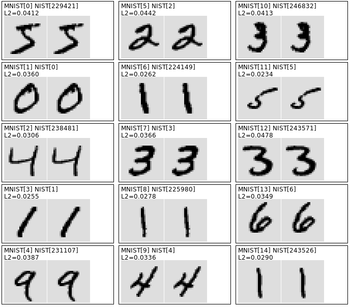

# QMNIST 

The exact preprocessing steps used to construct the [MNIST dataset](http://yann.lecun.com/exdb/mnist) have long been lost. This leaves us with no reliable way to associate its characters with the ID of the writer and little hope to recover the full MNIST testing set that had 60K images but was never released. The official MNIST testing set only contains 10K randomly sampled images and is often considered too small to provide meaninful confidence intervals.

The **QMNIST** dataset was generated from the original data found in the [NIST Special Database 19](https://www.nist.gov/srd/nist-special-database-19) with the goal to match the MNIST preprocessing as closely as possible. 

QMNIST is licensed under the BSD-style license found in the LICENSE file in the root directory of this source tree.

## 1. The reconstruction 

This reconstruction was achieved with several steps:

1. Start with a first reconstruction algorithm according to the information found in the [paper introducing the MNIST dataset](http://leon.bottou.org/papers/bottou-cortes-94).
2. Use the Hungarian algorithm to find the best pairwise match between the MNIST training digits and our reconstructed training digits. Visually examine the poorest matches, trying to understand what the MNIST authors could have done differently to justify these differences without at the same time changing the existing close matches.
3. Try new variants of the reconstruction algorithm, match their outputs to their best counterpart in the MNIST training set, and repeat the process. 

This seemingly endless process is surprisingly addictive and allowed us to uncover a lot of previously unknown facts about MNIST (see the companion paper). At some point however, we had to decide that our reconstruction was sufficiently close. In the current state, out of the 60000 reconstructed training digits, 147 are shifted by one pixel relative to their MNIST counterpart. This arises because their barycenters were very close from a pixel boundary. After accounting for these 147 shifted images, we can compute a L2 distance between the  MNIST and QMNIST images. The following table gives the
quartiles of this distance distribution:

|            | Min |  25%  | Median |  75%  |  Max  |
|------------|:---:|:-----:|:------:|:-----:|:-----:|
|L2 distance |  0  | 7.1 |  8.7  | 10.5 | 17.3 |
|Linf distance | 0 | 1 | 1 | 1 | 3 |

The Linf distance represents the maximal difference in pixel values, on a [0,255] range, observed between a MNIST digit and its correctly shifted QMNIST counterpart. Since this distance is small and since only 147 digits need shifting, we believe that our reconstruction is quite good. For intance, the following picture displays the first 15 MNIST and QMNIST training digits side by side.



In order to further verify the quality of our reconstruction, we have trained a variant of the Lenet5 network described in the popular ["Gradient Based Learning Applied to Document Recognition"](http://leon.bottou.org/papers/lecun-98h) paper.  In fact we used the [original Lenet5 implementation](https://sourceforge.net/p/lush/code/HEAD/tree/lush1/trunk/packages/gblearn2/demos/lenet5.lsh) which is provided as a demo in the [Lush](http://lush.sf.net) neural network package. This particular variant is similar to the Lenet5 variant described in the paper except that it omits the final Euclidian layer and yet provides similar performance. Following the pattern set by this implementation, the training protocol consists of three sets of 10 epochs with global stepsizes 1e-4, 1e-5, and 1e-6. Each set starts with an estimate of the diagonal of the Hessian. The
per weight stepsizes are computed by dividing the global stepsize by
the estimated curvature plus 0.02.


|                   | Test on MNIST10K  | Test on QMNIST10K  | Test on QMNIST50K  |
|-------------------|:-----------------:|:------------------:|:------------------:|
| *Train on MNIST*  |   0.82% (±0.2%)   |   0.81% (±0.2%)    |   1.08% (±0.1%)    |
| *Train on QMNIST* |   0.81% (±0.2%)   |   0.80% (±0.2%)    |   1.08% (±0.1%)    |

The following table provides the resulting testing performance
together with two-sigma error bars. The QMNIST10K test uses the
first 10000 QMNIST testing digits, that is, the reconstruction
of the ordinary MNIST testing set. The QMNIST50K test uses the
remaining 50000 QMNIST testing digits, that is, the reconstruction
of the lost MNIST testing digits.

Although all these results are within the statistical noise, they
suggest that either the QMNIST50K digits are a bit more challenging,
or that the smaller MNIST testing set had already been overused by the
time of the Lenet5 experiments. They also show that networks trained
on either dataset yield very similar results when tested on the other
dataset. In fact the tests on MNIST10K and QMNIST10K predict 
exactly the same class, except for a single example for which
the networks gives very similar scores for the two top classes.


## 2. Using QMNIST

We describe below how to use QMNIST in order of increasing complexity.

### 2.1. Using the QMNIST extended testing set

The simplest way to use the QMNIST extended testing set is 
to download the two following files.  These gzipped files
have the same format as the standard [MNIST data files](http://yann.lecun.com/exdb/mnist) but contain the 60000 testing examples. The first 10000 examples are
the QMNIST reconstruction of the standard MNIST testing digits.
The following 50000 examples are the reconstruction of the lost MNIST testing digits. 

| Filename | Format | Description |
|----------|:------:|-------------|
| `qmnist-test-images-idx3-ubyte.gz` | 60000x28x28 | testing images
| `qmnist-test-labels-idx1-ubyte.gz` | 60000 | testing labels


### 2.2. Using the QMNIST extended labels

The official NIST training data (series hsf0 to hsf3, writers 0 to 2099) was written by NIST employees. The official testing data (series hsf4, writers 2100 to 2599) was written by high-school students and is considered to be substantially more challenging. Since machine learning works better when training and testing data follow the same distribution, the creators of the MNIST dataset decided to distribute writers from both series into their training and testing sets. The QMNIST extended labels trace
each training or testing digit to its source in the [NIST Special Database 19](https://www.nist.gov/srd/nist-special-database-19). Since the QMNIST training set and the first 10000 examples of the QMNIST testing set exactly match the MNIST training and testing digits, this information can also be used for the standard MNIST dataset. The extended labels are found in the following files.

| Filename | Format | Description |
|----------|:------:|-------------|
| `qmnist-train-labels-idx2-int.gz` | 60000x8 | extended training labels
| `qmnist-train-labels.tsv.gz` | 60000x8 | same, tab separated file
| `qmnist-test-labels-idx2-int.gz` | 60000x8 | extended testing labels
| `qmnist-test-labels.tsv.gz` | 60000x8 | same, tab separated file

The format of these gzipped files is very simlar to the format of the standard [MNIST label files](http://yann.lecun.com/exdb/mnist). However, instead of being a one-dimensional tensor of unsigned bytes (`idx1-ubyte`), the label tensor is a two-dimensional tensor of integers (`idx2-int`) with 8 columns:

| Column | Description  | Range |
|:------:|--------------|-------|
| 0 | Character class | 0 to 9
| 1 | NIST HSF series | 0, 1, or 4
| 2 | NIST writer ID | 0-326 and 2100-2599  
| 3 | Digit index for this writer | 0 to 149
| 4 | NIST class code | 30-39
| 5 | Global NIST digit index | 0 to 281769
| 6 | Duplicate | 0
| 7 | Unused | 0

The binary files `idx2-int` encode this information
as a sequence of big-endian 32 bit integers

| Offset | Type | Value | Description |
|--------|------|-------|-------------|
| 0 | 32 bit integer | 0x0c02(3074) | magic number
| 4 | 32 bit integer | 60000 | number of rows
| 8 | 32 bit integer | 8 | number of columns
| 12.. | 32 bit integers | ... | data in row major order

Due to popular demand, we also provide the same information as TSV files.


### 2.3. The QMNIST data files

The QMNIST distribution provides in fact the following files:

| Filename | Format | Description |
|----------|:------:|-------------|
| `qmnist-train-images-idx3-ubyte.gz` |  60000x28x28 | training images
| `qmnist-train-labels-idx2-int.gz` | 60000x8 | extended training labels
| `qmnist-train-labels.tsv.gz` | 60000x8 | same, tab separated file
| `qmnist-test-images-idx3-ubyte.gz` | 60000x28x28 | testing images
| `qmnist-test-labels-idx2-int.gz` | 60000x8 | extended testing labels
| `qmnist-test-labels.tsv.gz` | 60000x8 | same, tab separated file
| `xnist-images-idx3-ubyte.xz` | 402953x28x28 | NIST digits images
| `xnist-labels-idx2-int.xz` | 402953x8 | NIST digits extended labels
| `xnist-labels.tsv.xz` | 402953x8 | same, tab separated file

Files with the `.gz` suffix are gzipped and can be decompressed with the standard commmand `gunzip`. Files with the `.xz` suffix are LZMA compressed and can be decompressed using the standard command `unxz`. 

The QMNIST training examples match the MNIST training example one-by-one and in the same order. The first 10000 QMNIST testing examples match the MNIST testing examples one-by-one and in the same order. The `xnist-*` data files provide preprocessed images and extended labels for all digits appearing in the [NIST Special Database 19](https://www.nist.gov/srd/nist-special-database-19) in partition and writer order. Column 5 of the extended labels give the index of each digit in this file. We found three duplicate digits in the NIST dataset. Column 6 of the extended labels then contain the index of the
digit for which this digit is a duplicate. Since duplicate digits have been eliminated
from the QMNIST/MNIST training set and testing set, this never happens in the `qmnist-*` extended label files.

#### 2.4. The Pytorch QMNIST loader

File `qmnist.py` contains a QMNIST data loader for the popular [Pytorch](http://pytorch.org) platform. It either loads the QMNIST data files provided in the same directory as the file `pytorch.py` or downloads them from the web when passing the option `download=True`. This data loader is compatible with the standard Pytorch MNIST data loader and also provided additional features whose documentation is best found in the comments located inside `pytorch.py`.

Here are a couple examples:

```python
from qmnist import QMNIST

# the qmnist training set, download from the web if not found
qtrain = QMNIST('_qmnist', train=True, download=True)  

# the qmnist testing set, do not download.
qtest = QMNIST('_qmnist', train=False)

# the first 10k of the qmnist testing set with extended labels
# (targets are a torch vector of 8 integers)
qtest10k = QMNIST('_qmnist', what='test10k', compat=False, download='True')

# all the NIST digits with extended labels
qall = QMNIST('_qmnist', what='nist', compat=False)
```

### 2.5. Citing QMNIST

More details found in the [companion paper](https://arxiv.org/abs/1905.10498).

```bibtex
@techreport{qmnistpaper,
   title = "Cold Case: The Lost MNIST Digits",
   author = "Chhavi Yadav and L\'{e}on Bottou",\
   institution = "arxiv:1905.10498",
   year = 2019,
   month = "may",
   url = "https://arxiv.org/abs/1905.10498"
}
```
